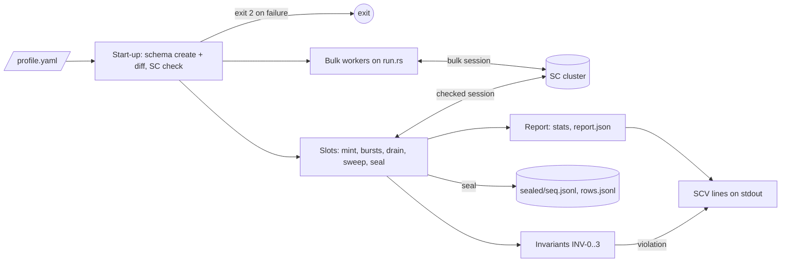
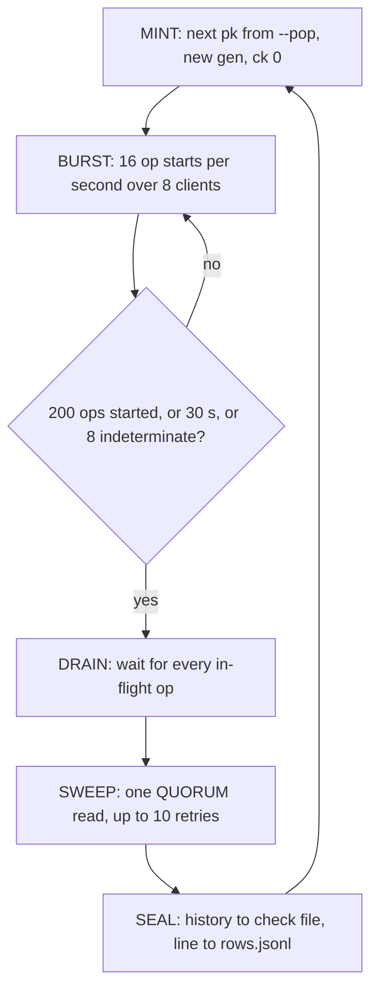

# SCYLLADB-4519 — `cql-stress-sc-verify`, milestone 1

Design source: [sc-verify spec](https://scylladb.atlassian.net/wiki/pages/viewpage.action?pageId=479887448)
(Confluence 479887448). Section numbers (§N) below refer to it. This file
states what the cql-stress repository builds for milestone 1 (M1). When the
two disagree, the Confluence spec is fixed first.

## Overview

A new binary, `cql-stress-sc-verify`, drives a strongly consistent (SC) table
from one YAML profile. In `verify` mode, 32 slots each work one fresh row
`(pk, gen, ck)` at a time. A slot's 8 clients fire bursts of overlapping
QUORUM reads and writes, with no retries. Every write stores its write id
(wid) in the cells it sets. Every read is checked at once by four streaming
invariants. After the drain and a final sweep read, the row is sealed: its
history goes to a check file and its summary to `rows.jsonl`. In `bulk` mode,
the existing `run.rs` loop drives plain, unchecked load. `both` runs the two
together. The SC keyspace check and the population parsers move from the
cassandra-stress binary into the library first, so both binaries share them.

## Constraints

- `cql-stress-cassandra-stress` keeps its CLI, output and exit codes
  byte-for-byte. Its unit tests and `cs_args_*_test.in` files pass unchanged.
- `run.rs` behaviour does not change: the daily performance runs depend on it.
- The new binary exists only in builds with the `strong-consistency` feature,
  which needs `RUSTFLAGS="--cfg scylla_unstable"`.
- On the checked path: no retries in the driver or the tool, no speculative
  execution, statements not idempotent, CL `QUORUM` or `LOCAL_QUORUM` (§8.3).
- All operation times come from one monotonic clock in the process (§8.4).
- `gen` exceeds 2^53, so every JSON file writes it as a string (§7.3).

## Design



A round of one slot (§8.2):



Outcome classes (§9). When in doubt, a write's outcome is unknown:

| Outcome | Recorded as |
|---|---|
| Success | call + return, `status: ok` |
| Write timeout, unknown-outcome server error, client timeout, broken connection, no host | indeterminate write: call only, no return |
| `Unavailable` | indeterminate; with `--unavailable-is-fail`, return `fail` and the wid is burned |
| `InvalidRequest`, syntax error, unauthorized | not recorded; counted; exit 3 after `--max-workload-errors` |
| Any failed read | not recorded |
| Read finds no row | return with every cell `null` |

Invariants (§10.2), checked per cell of every recorded read. Floors are copied
before the read's start time is taken, and an operation updates the floors only
after it has taken its end time (§10.1):

| Id | Fires when |
|---|---|
| INV-0 | the wid was never issued, was burned, or does not decode |
| INV-1 | null although an acknowledged write had ended before the read began, or the wid ended before `ack_floor` |
| INV-2 | null although an earlier finished read saw a value, or the wid ended before `obs_floor` |
| INV-3 | the wid also set cell *d*, and *d* is null or holds a wid that ended before this wid started |

An indeterminate write has an end of infinity, so it is never "definitely
older".

Failure behaviour:

| Condition | Behaviour |
|---|---|
| Live table differs from the profile | exit 2 with a per-column diff, nothing written |
| Driver does not report the keyspace as `Global` | exit 2 with `STRONG_CONSISTENCY_UNAVAILABLE` |
| An invariant fires | `SCV violation` line at once; the row is kept in `archive/`; the slot goes on; exit 1 at the end |
| Sweep fails 10 times | row sealed with `sweep: incomplete` |
| Indeterminate writes reach `--max-indeterminate` | no new starts; drain; seal with `stop_reason: indeterminate` |

## Contracts

### Inputs

Profile (§15.1), the only schema definition:

```yaml
keyspace: sc_verify
replication_factor: 3
tablets_initial: 128
table: reg
cells: [bigint, text, blob]       # 1..8 of int, bigint, text, blob
text_size: 32
blob_size: 64
bulk_table: null
```

Command (§15.2; M1 subset). The M2 checker and read-back flags are deferred:

```text
cql-stress-sc-verify --profile <file> --mode verify|bulk|both
  --nodes <host[:port],...> --user <u> --password <p>
  --ssl [--ssl-ca <pem>] [--ssl-cert <pem> --ssl-key <pem>]
  --consistency quorum|local-quorum
  --duration <30s|5m|4h> | -n <ops>        one is required; -n only with --mode bulk
  --pop --slots --clients-per-row --ops-per-gen --max-gen-duration
  --burst-ops --burst-interval --read-ratio --insert-ratio --request-timeout
  --sweep-retries --sweep-backoff --max-indeterminate --unavailable-is-fail
  --max-workload-errors --ttl --history-dir --check-rows --check-age
  --checker off --report-interval
  --bulk-op write|read|mixed --bulk-read-ratio --bulk-pop --bulk-threads
  --bulk-rate --bulk-read-consistency quorum|one --bulk-retries
```

### Outputs

Schema (§7.1), created with `IF NOT EXISTS` by every mode:

```sql
CREATE KEYSPACE sc_verify WITH replication = {'class': 'NetworkTopologyStrategy', 'replication_factor': 3}
  AND tablets = {'initial': 128} AND consistency = 'global';
CREATE TABLE sc_verify.reg (pk bigint, gen bigint, ck int, c0 bigint, c1 text, c2 blob,
  PRIMARY KEY ((pk), gen, ck));
```

Keys: checked `gen = start_unix_ms × 2^20 + n` (≥ 2^60); bulk `gen = f(pk) < 2^40`.
Write ids count from 1 within a row and stay below 2^63. Cell encodings (§7.2):
`bigint`/`int` = wid (`int` below 2^31); `text` = `"<wid>:"` + filler to
`text_size`; `blob` = wid as 8 bytes little-endian + filler to `blob_size`.

History, check file `sealed/<seq>.jsonl` (§14.1, format v2, owned by porcupine_validator):

```jsonl
# key 0 pk 7 gen "1882..." ck 0
{"id":1,"client_id":0,"kind":"call","op":"write","key":0,"cells":[1,1,1],"time_ns":1000}
{"id":1,"client_id":0,"kind":"return","op":"write","key":0,"time_ns":1900,"status":"ok"}
{"id":2,"client_id":1,"kind":"call","op":"write","key":0,"cells":[2,null,2],"time_ns":1500}
{"id":3,"client_id":2,"kind":"call","op":"read","key":0,"time_ns":1600}
{"id":3,"client_id":2,"kind":"return","op":"read","key":0,"cells":[1,1,1],"time_ns":2100,"status":"ok"}
```

`rows.jsonl`, one line per sealed row (§14.3). In M1 `verdict` is
`violation` or `unchecked`:

```json
{"pk":7,"gen":"1882...","ck":0,"slot":3,"file":"12","key":17,"wall_start_ms":0,"wall_end_ms":0,
 "ops":137,"reads":70,"writes_ok":57,"writes_indet":10,"errors":0,"max_gap_ms":1840,
 "stop_reason":"ops|time|indeterminate|end","invariants":"ok","sweep":"ok|incomplete","verdict":"unchecked"}
```

`SCV` lines on stdout (§14.4). M1 prints `start`, `violation`, `stats`, `end`:

```text
SCV {"t":"start","mode":"both","pop":"seq=0..2047","slots":32,"gen_base":"..."}
SCV {"t":"violation","kind":"INV-3","pk":7,"gen":"...","cell":"c1","wall_ms":1791293683732,"archive":"archive/12"}
SCV {"t":"stats","verified_ops_s":0,"bulk_ops_s":0,"read_p99_ms":0,"write_p99_ms":0,"indet_pct":0,"sched_delay_p99_ms":0}
SCV {"t":"end","exit":0}
```

`report.json` holds the totals and is rewritten every `--report-interval` and
at exit. Exit codes (§14.5): 0 clean, 1 violation, 2 setup failure, 3 too many
tool or profile errors (or a crashed slot). When several apply, the highest wins.

### Module API

Library, new module `cql_stress::strong_consistency` (feature `strong-consistency`),
moved from the cassandra-stress binary:

```rust
pub const STRONG_CONSISTENCY_UNAVAILABLE_CODE: &str = "STRONG_CONSISTENCY_UNAVAILABLE";
/// Refreshes metadata, then returns the driver's view of the keyspace; None = absent.
pub async fn keyspace_consistency_mode(session: &Session, keyspace: &str) -> Result<Option<ConsistencyMode>>;
/// The start-up failure: carries the code and the per-node TABLETS_ROUTING_V2 diagnosis.
/// `tls`: the probe speaks plaintext CQL, so a TLS run is told the nodes were not asked.
pub async fn unavailable_error(keyspace: &str, reported_mode: &str, ddl: &str, nodes: &[String], tls: bool) -> anyhow::Error;
pub async fn fetch_protocol_features(node: &str) -> Result<ProtocolFeatures>;
```

Library, `cql_stress::java_generate::distribution`, moved unchanged with the
`Distribution` and `DistributionFactory` traits, plus the population parser:

```rust
/// "seq=a..b" (inclusive) or "dist=<distribution>", as cassandra-stress -pop accepts it.
pub fn parse_population(s: &str) -> Result<Box<dyn DistributionFactory>>;
```

## Risks

| Risk | Response |
|---|---|
| scylla-rust-driver 1.9.0 cannot turn off retries or speculative execution per session | Checked first, with a unit test on the execution profile. If there is a gap, stop and ask before any workaround. |
| The library move changes cassandra-stress behaviour | The move is mechanical; the golden files and unit tests must pass unchanged. |
| Bulk in `both` stretches the checked operation times | Separate driver sessions; the calibration run (§22) compares write p99 with `verify` alone. |
| An overloaded loader stretches operation times | `sched_delay_p99_ms` in every `stats` line. |

## Deferred work

Milestone 2 (§11, §12), on branch `feat/sc-verify-m2`: the checker queue and
child workers, canaries, `expected.jsonl` and the end-of-run read-back,
bundling `porcupine_checker` into the image. M1 already writes the check
files and the `archive/` layout these need, and the CLI leaves room for
`--checker on`. The later phases (§17) need `ck`, which stays 0 in M1.

## Decisions

- One task directory covers all CS work for SCYLLADB-4519; the small steps live in `plan.md`, not in Jira subtasks. (spec)
- The Confluence spec is the design source; this file condenses the part that cql-stress builds. (spec)
- `unavailable_error` takes the reported mode as text and a `tls` flag, so the cassandra-stress message stays the same for TLS runs. (build)
- One spec for all of M1, not split off for the T1/T2 library move: Confluence §6 sets one PR per repo per milestone. (review)
- `clap` is added for the new binary's CLI (user, 2026-09-25). (spec)
- The binary has `required-features = ["strong-consistency"]`, and that feature also turns on `serde`, `serde_yaml` and `clap`. A default build stays as it is. (spec)
- TLS is in M1: `--ssl` with PEM files through `openssl`. The server certificate is verified only when `--ssl-ca` is given, as in cassandra-stress (user, 2026-10-06). (spec)
- A read cell that does not decode is written to the history as wid `-1`, which is never issued, so the checker cannot explain that read either; `null` would hide it. (build)
- When several exit codes apply, the highest wins: 3 over 2 over 1. A run whose tool failed cannot vouch for its verdicts, which is worse than a finding. (build)
- `--ttl` above 0 must cover 10 rounds of the longest possible length: `max_gen_duration + request_timeout + sweep_retries × (sweep_backoff + request_timeout)` (§7.4). (build)
- The `SCV violation` line is printed when the row seals, once its check file is in `archive/<seq>/`, so SCT can copy the evidence before it raises the event; `wall_ms` says when the read exposed the violation, so SCT still places it next to the nemesis that caused it. A human-readable line is printed at detection. (build)
- `stats` lines cover one `--report-interval`; latencies are p99 of successful operations; `sched_delay_p99_ms` is how late the slots' burst ticks ran. (build)
- In `rows.jsonl`, `errors` counts failed reads, `fail` writes and workload errors; indeterminate writes are counted only in `writes_indet`. (review)
- M1 accepts only `--checker off`, so SCT commands written for M1 stay valid in M2. (spec)
- The moved code keeps its names, except that `diagnose_missing_strong_consistency` becomes the free function `diagnose_v2`. One `#[cfg(feature = "strong-consistency")]` on the library module replaces the per-item gates. The parts specific to cassandra-stress stay in that binary: the CL check and the datacenter warning. (review)
